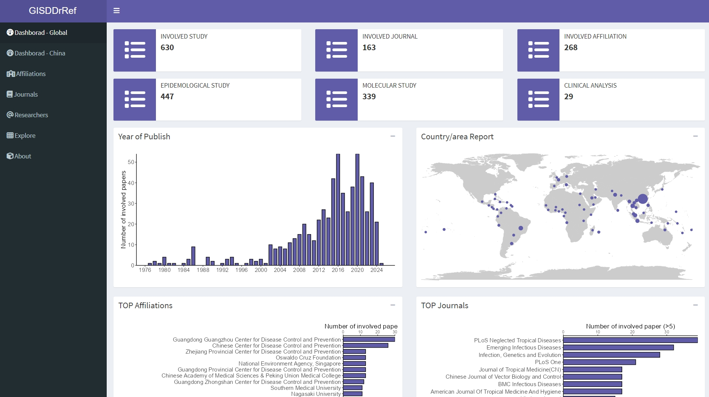
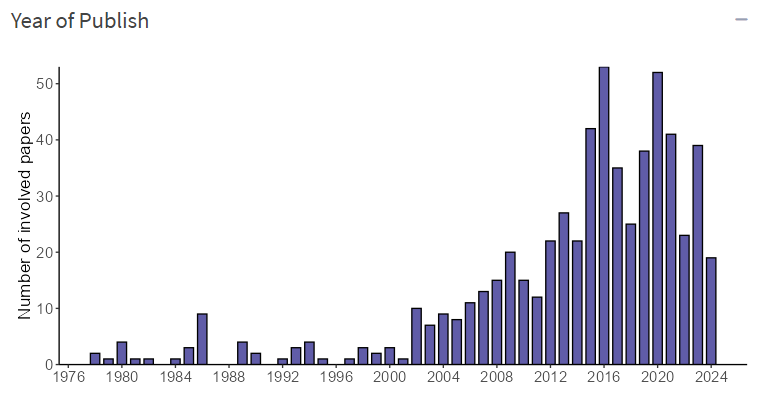
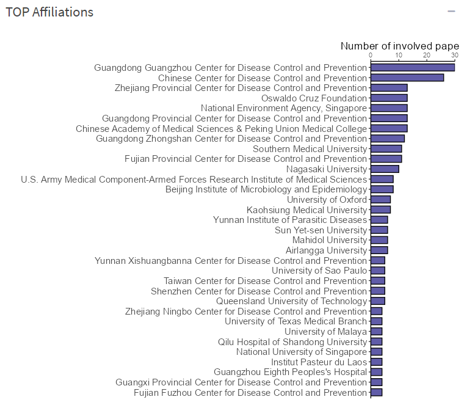
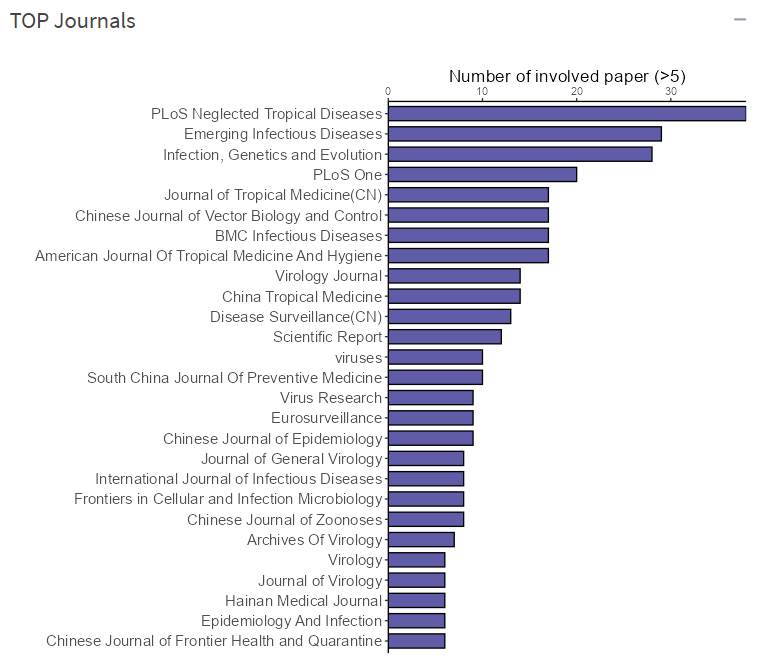
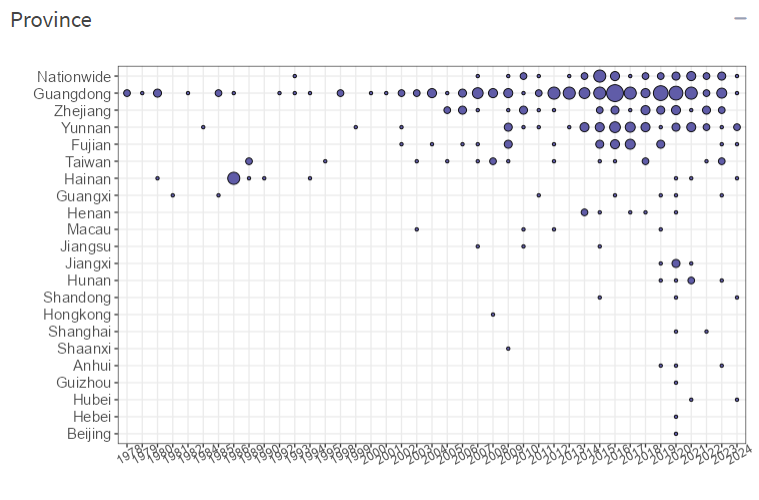
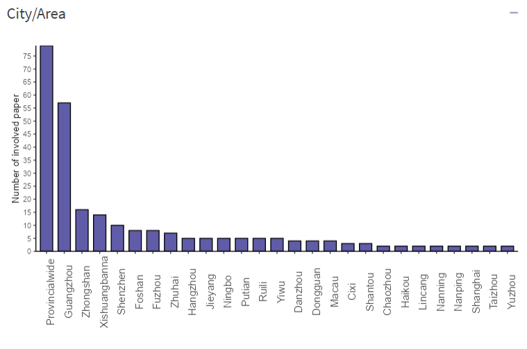

# GISDDrRef





## Installation

Dependency:  r-package: shiny, shinydashboard, readxl, dplyr, tidyr, maps,DT, ggplot2, viridis

```
library(devtools)
install_github('GuoXiang9399/GISDDrRef')
```


```
shiny::runApp('GISDDrRef')
```

## Dashboard







## Dashboard for China






## Contributing
Xiang Guo  Southern Medical University, China

Please contact me by email guoxiang199399@163.com for submitting bugs.
